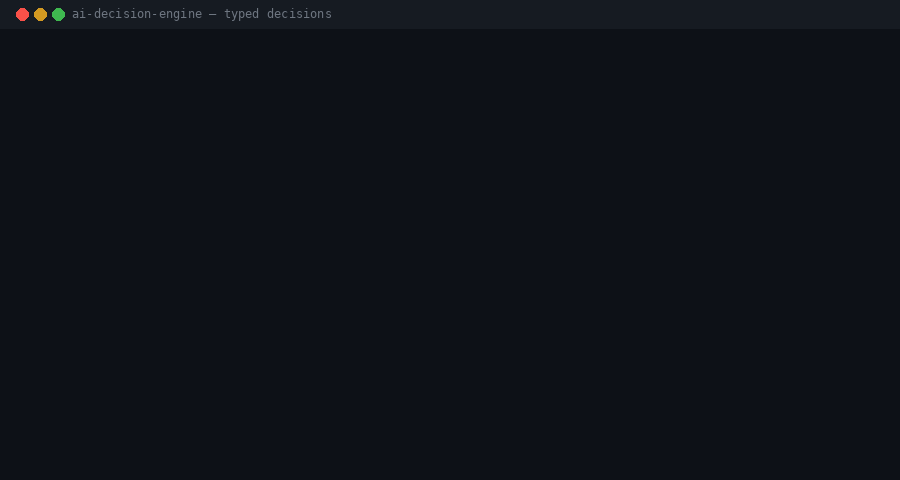

# AI Decision Engine

**Give your agents typed decisions instead of parsing LLM text.**



[](LICENSE)
[](https://www.python.org/)
[-7c3aed.svg)](https://openrouter.ai/)
[](https://github.com/sergio-lim/ai-decision-engine/actions/workflows/ci.yml)

A small, stdlib-only Python engine that classifies inbound recruiter replies with **[Jev](https://openrouter.ai/)** — a TypeSafe decision model — and routes them by **confidence**. The regex baseline is included so you can see why keyword piles fail the moment a polite email also asks for salary.

No pip dependencies. No `.env` in the repo. No personal data.

---

## Why

Most agent pipelines still do **prompt-and-parse**:

1. Stuff a blob of text into a chat model.
2. Hope it answers `simple_ack` and not `Sure — this looks like a simple ack!`.
3. Regex the prose. Add another `if`. Ship it. Watch it break in Spanish.

A **typed decision model** flips that:

- You declare the questions (`choice`, `noul`, `score`) and the criteria.
- The model returns **typed answers + probabilities**, not a paragraph.
- Your code branches on numbers and enums. Ambiguous cases go to a human.

That is the whole product: decisions as an API, not as a string you have to interpret.

## How it works

```
  inbound text
       │
       ▼
 ┌─────────────┐     ┌──────────────────┐     ┌─────────────────────────┐
 │ state       │     │  Jev             │     │ typed answers           │
 │ + questions │────▶│  typesafe/jev    │────▶│ + probabilities         │
 └─────────────┘     └──────────────────┘     └───────────┬─────────────┘
                                                          │
                                                          ▼
                                               ┌─────────────────────────┐
                                               │ confidence router       │
                                               │                         │
                                               │  conf ≥ 0.80 and        │
                                               │  choice=acuse_simple    │
                                               │  and no hot flags       │
                                               │       → simple_ack      │
                                               │                         │
                                               │  0.50 ≤ conf < 0.80     │
                                               │       → review (human)  │
                                               │                         │
                                               │  otherwise              │
                                               │       → needs_judgment  │
                                               └─────────────────────────┘
```

`simple_ack` is auto-applied only when all three hold: the choice is `acuse_simple`, confidence is at least **0.80**, and none of the six noul flags (`pide_info`, `propone_entrevista`, `menciona_salario`, `requiere_work_auth`, `es_rechazo`, `es_bounce`) is above 0.5. Mid-confidence is not "probably fine" — it is a **review** route.

The regex baseline does the opposite: if it sees `thanks` / `gracias` / `recibido`, it files the message as an ack. That is why a salary question that starts with "Thanks for your interest" gets auto-archived.

## Results

16 labeled replies (`data/labeled_set.json`). Same inputs, two classifiers.

| classifier | accuracy | errors (ids) | cost | mean latency |
|:-----------|---------:|:-------------|-----:|-------------:|
| regex baseline | 75.0% | 9, 10, 13, 16 | $0 | <1 ms |
| **Jev + router** | **100%** | none | $0.000517 | 1.42 s / call |

Generated by `python3 main.py --benchmark` → [`results/benchmark.md`](results/benchmark.md). Re-run to refresh cost and latency.

The regex short-circuits on `thanks` / `gracias` / `recibido`, so it files a salary ask, a Spanish interview invite, a bounce, and a Spanish compensation question as `simple_ack`. Jev scores the choice and the six flags independently, so courtesy words no longer win.

## Quickstart

```bash
export OPENROUTER_API_KEY=
python3 main.py --classify "Hola Sergio, recibido! Cualquier novedad te aviso."
python3 main.py --classify "Could you share your salary expectations?"
python3 main.py --benchmark
```

Classify prints a JSON object: `classification`, `route`, `confidence`, `flags`, `usage`. Nothing else is required — Python 3.10+ stdlib only (`urllib`, `json`, `re`, `argparse`, …).

```bash
# optional: side-by-side demo
python3 main.py --demo

# optional: regenerate the README gif (needs Pillow)
python3 tools/make_demo_gif.py
```

[`.env.example`](.env.example) documents the only required variable. The engine reads `OPENROUTER_API_KEY` from the environment and never prints it.

## Project structure

```
ai-decision-engine/
  main.py                 # CLI: --classify | --benchmark | --demo
  decision_engine/
    client.py             # get_api_key(), decide()
    presets.py            # reply_classify + ticket_triage
    router.py             # classify_with_confidence()
    baseline.py           # fragile regex classifier
    benchmark.py          # labeled_set → results/benchmark.md
  data/labeled_set.json   # 16 bilingual gold labels
  examples/run_cli.sh
  tools/make_demo_gif.py
  assets/demo.gif
```

Two presets ship in `presets.py`:

- **`reply_classify`** — one `choice` (`acuse_simple` / `requiere_decision`) and six `noul` flags. This is what the CLI and benchmark use.
- **`ticket_triage`** — `choice` + `score` + `noul`, so you can see all three Jev question types. Same client, different questions.

## Limitations

- **Context window is 32k.** Long threads need trimming (`sanitize_state_text` already caps inbound text).
- **Jev does not generate text.** It answers the questions you declared. If you need a reply draft, that is a different model.
- **Prompt injection is still a thing.** Whatever you put in `state` is read by the model. Sanitize untrusted email/chat (control characters, length, unexpected instructions) before you call `decide()`.
- **Confidence is not certainty.** The review band exists because 0.62 is not a production decision.

## License

[MIT](LICENSE) — Copyright (c) 2026 Sergio Lim.
